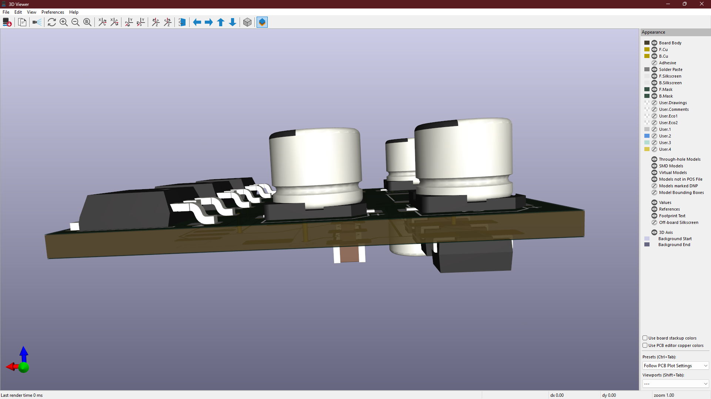
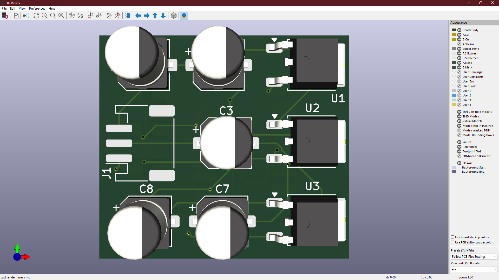
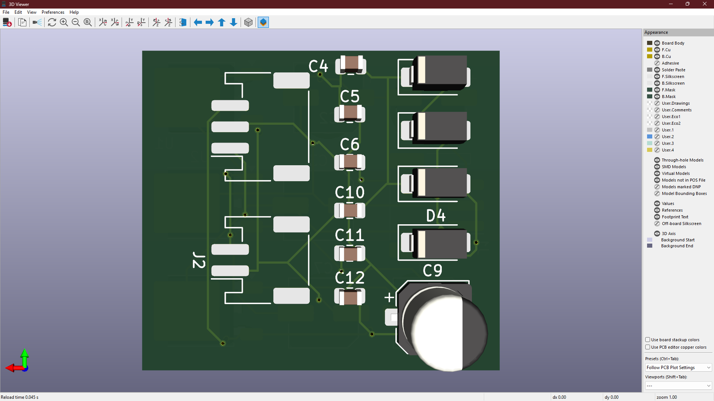

# 🧩 KiCad Hardware Design Project

## 🔍 Overview
This repository contains an open-source **SMD-based hardware design** created using **KiCad**.  
It includes complete **schematic diagrams, PCB layout, and manufacturing-ready files**.  
The project is intended for **learning, reference, and practical PCB prototyping**.

## 🛠️ Tools Used
- 🧰 **KiCad** (Version 7 or later)
- 🖼️ PCB Editor
- 🔷 3D Viewer

## 🖼️ Design Previews

### 🔷 PCB 3D View

### 🔷 Top Layer

### 🔷 Bottom Layer

## 🗂️ Repository Structure
HARDWARE/ → KiCad schematic and PCB design files
IMAGES/ → Schematic, PCB layout, and 3D render images
BOM/ → Bill of Materials
GERBER/ → Manufacturing-ready Gerber files

## 🚀 How to Open the Project
1. Install **KiCad (v7 or later)**
2. Clone this repository
3. Open the `.kicad_pro` file using KiCad

## 📦 Project Outputs
- ✅ Complete schematic design
- ✅ PCB layout (top & bottom layers)
- ✅ 3D PCB visualization
- ✅ Bill of Materials (BOM)
- ✅ Gerber files for PCB fabrication

## 📄 License
📜 This project is licensed under the **MIT License**

## 👤 Author
**Naraender**

## ⭐ Notes
If you find this repository useful, consider giving it a ⭐ and using it as a reference for your own **KiCad hardware projects**.
